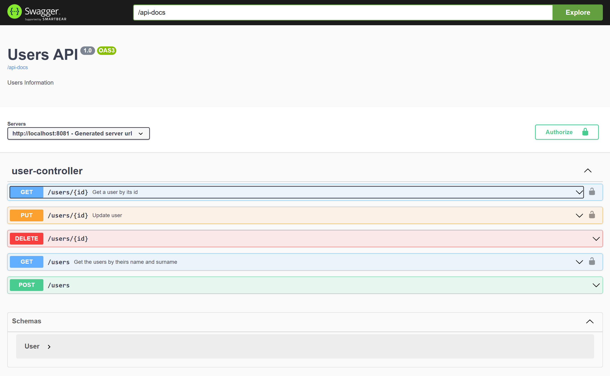

### Caratteristiche
1. un' applicazione con lo stack che preferisce basata su Java (Spring Boot)
2. espone 4 endpoint di CRUD sull'entità User (con nome, cognome, email, password e indirizzo per esempio)
3. una API di ricerca degli utenti: o per nome, o per cognome, o per nessun parametro
4. DB postgres gestito da Docker
5. Test di Unità con l'utilizzo di RestAssured
6. Creazione di una immagine Docker del progetto
7. Gestione del progetto con Git

# Getting Started

Creare se non presente nella root una cartella var con una sotto cartella log (/var/log)

Per eseguire il deploy in docker dell'applicativo utilizzare i seguenti comandi nella cartella del progetto:

> mvn clean package -DskipTests
> 
> docker-compose -f docker-compose-dev.yml up -d --build

In alternativa è possibile utilizzare lo script:

> .\build.bat

---

Per avere il database in locale per i test tramite l'IDE utilizzare il comando: 

> docker-compose -f docker-compose.yml up -d

---
Eseguendo l'applicativo con il profilo **test**, è possibile utilizzare il frontend di swagger per interagire con le API registrandosi con l'utenza configurata.

Utenza:

> Username: **user**
>
> Password: **secret**

Endpoint swagger:

> http://localhost:8081/api-docs/
>
> http://localhost:8081/swagger-ui/index.html?configUrl=/api-docs/swagger-config

---

> 

---
### Reference Documentation

For further reference, please consider the following sections:

* [Official Apache Maven documentation](https://maven.apache.org/guides/index.html)
* [Spring Boot Maven Plugin Reference Guide](https://docs.spring.io/spring-boot/docs/2.6.4/maven-plugin/reference/html/)
* [Create an OCI image](https://docs.spring.io/spring-boot/docs/2.6.4/maven-plugin/reference/html/#build-image)
* [Spring Web](https://docs.spring.io/spring-boot/docs/2.6.4/reference/htmlsingle/#boot-features-developing-web-applications)
* [Spring Data JPA](https://docs.spring.io/spring-boot/docs/2.6.4/reference/htmlsingle/#boot-features-jpa-and-spring-data)

### Guides

The following guides illustrate how to use some features concretely:

* [Building a RESTful Web Service](https://spring.io/guides/gs/rest-service/)
* [Serving Web Content with Spring MVC](https://spring.io/guides/gs/serving-web-content/)
* [Building REST services with Spring](https://spring.io/guides/tutorials/bookmarks/)
* [Accessing Data with JPA](https://spring.io/guides/gs/accessing-data-jpa/)
